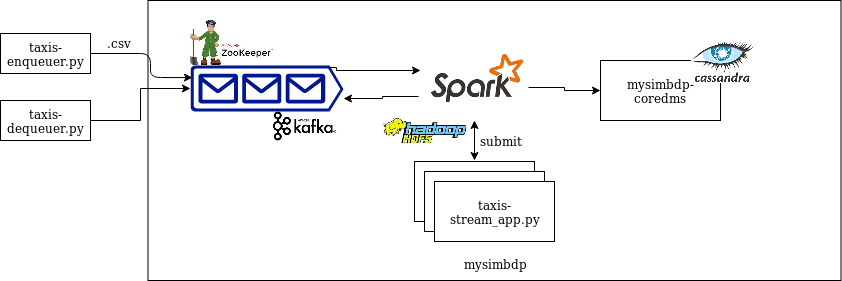

# Assignment 3

In this project we simulate the behaviour of a streaming application executing simple analytics on input data. 

Once built the software is organized as represented below:

```bash
code
├── app-env.sh
├── clear_ssh.sh
├── client
│   ├── taxis-dequeuer.sh
│   └── taxis-enqueuer.py
├── download_apps.sh
├── mysimbdp
│   ├── conf_files
│   ├── hadoop-3.1.2
│   ├── kafka-2.3.1
│   ├── pydeps
│   ├── pydeps.zip
│   ├── requirements.txt
│   ├── spark-2.4.4
│   └── taxis-streamapp.py
├── README.md
├── ssh_setup.sh
├── start_app.sh
└── stop_app.sh
```

* `client`: contains the programs executed on the client machine;
* `mysimbdp`: will include the actual components of the platform and their [configuration](code/mysimbdp/conf_files);
* `code`: is composed also of setup scripts.

Follow the [deployment guide](code/README-deployment.md), to deploy this software as a standalone application in your local machine. 

You may find interesting to view some [logs](logs/2.4/spark-logs) of the application.

The design of the developed application can be found in . The spare architectures in [design](design) refer to extra tasks of the assignment, respectively:

> Question 3.1:
> If you would like the analytics results to be stored also into mysimbdp-coredms as the final sink, how would you modify the design and implement this (better to use a figure to explain your design). (1 point)
>
> Question 3.3:
> Assume that the streaming analytics detects a critical condition (e.g., a very high rate of alerts) that should trigger the execution of a batch analytics to analyze historical data. How would you extend your architecture in Part 1 to support this (use a figure to explain your work)?. (1 point)
>
> -- <cite>HL, professor of Big Data Platform at Aalto University<cite>

